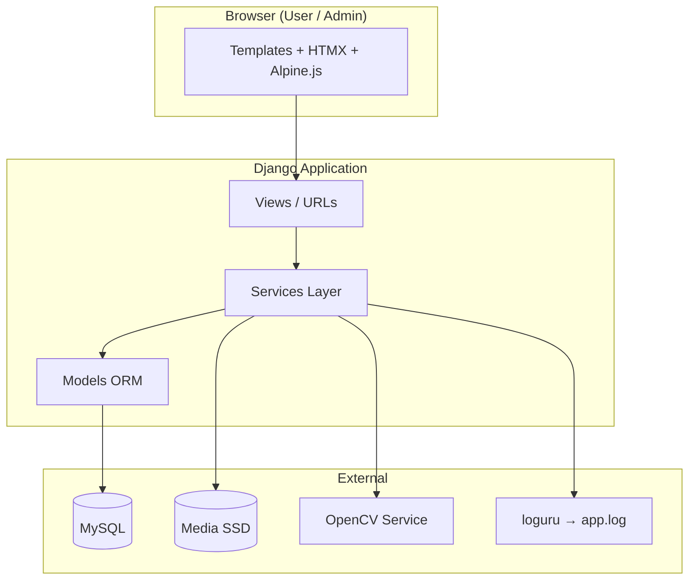
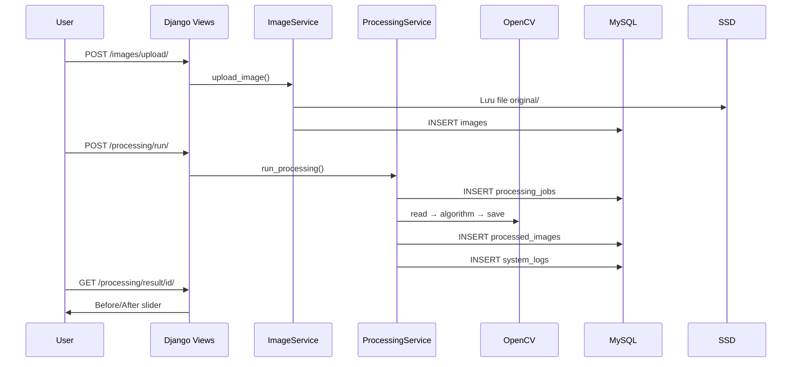

# Kiến trúc hệ thống

## Tổng quan 3 tầng



## Luồng xử lý ảnh (core business)



## Cấu trúc apps

| App | Trách nhiệm |
|-----|-------------|
| `authentication` | User model, login, `init_db` |
| `dashboard` | Trang tổng quan user |
| `images` | Upload, gallery, delete |
| `algorithms` | Seed & CRUD thuật toán |
| `processing` | Jobs, pipeline, history |
| `admin_panel` | Admin UI + `SystemLog` |

## OpenCV service layer

```
services/opencv/
├── algorithm_catalog.py   # 72 thuật toán — metadata (name, description, icon)
├── registry.py            # Map code → handler, process_image()
├── opencv_service.py      # Đọc/ghi ảnh từ media
├── helpers.py             # ensure_bgr, scale, draw_banner, ...
├── model_loader.py        # YOLO / SSD / DNN từ static/opencv_models/
├── exceptions.py
└── processors/            # 12 module theo nhóm thuật toán
    ├── basic.py           # grayscale, resize, crop, CLAHE, ...
    ├── filtering.py       # gaussian, median, bilateral, ...
    ├── edges.py           # canny, sobel, laplacian, ...
    ├── threshold.py       # binary, otsu, adaptive, ...
    ├── morphology.py      # erosion, dilation, opening, ...
    ├── contours.py        # contour, convex hull, shape, ...
    ├── detection.py       # haar, HOG, MOG2, ...
    ├── color.py           # RGB split, HSV, K-Means, ...
    ├── geometric.py       # affine, perspective, rotation, ...
    ├── advanced.py        # pyramid, template matching, ORB, ...
    ├── ocr.py             # Tesseract + contour fallback
    └── dnn.py             # YOLO, SSD, LBPH, embedding
```

**Registry pattern:** `Algorithm.code` trong DB phải khớp key trong `processors/__init__.py` → `ALL_PROCESSORS`.

**Seed:** `seed_algorithms` đồng bộ catalog ↔ registry trước khi ghi DB; `init_db` gọi seed sau migrate.

**Fallback khi thiếu phụ thuộc:**

| Nhóm | Thiếu | Fallback |
|------|-------|----------|
| OCR | Tesseract binary | Phát hiện vùng chữ bằng contour |
| YOLO / SSD | Model file | HOG people detector |
| DNN classification / embedding | Model file | Thống kê blob |
| LBPH | opencv-contrib | Haar face cascade |

Chi tiết danh sách 72 `code`: [opencv-algorithms.md](opencv-algorithms.md)

## Bảo mật & phân quyền

- `@login_required` — mọi trang user/admin (trừ auth)
- `@admin_required` — `/admin-panel/*` (role=admin)
- User chỉ truy cập ảnh/job của mình; **admin xem được mọi job**

## Frontend stack

| Thành phần | Dùng cho |
|------------|----------|
| Tailwind + DaisyUI | Layout, components |
| HTMX | Upload, xử lý, filter bảng |
| Alpine.js | Pipeline steps, Before/After slider |
| GSAP | Animation trang, toast |
| app.js / app.css | Toast, skeleton, progress bar |

## Deploy notes (tham khảo)

- `DEBUG=False`, `ALLOWED_HOSTS`, `CSRF_TRUSTED_ORIGINS`
- `collectstatic` + reverse proxy (nginx)
- MySQL connection pool, backup media + DB
- File log rotation đã cấu hình trong loguru (7 ngày)
