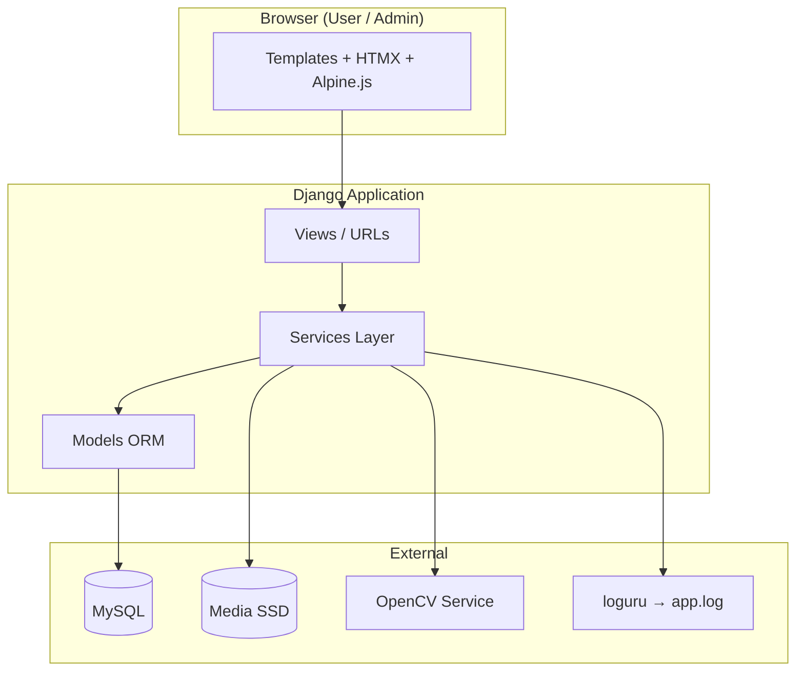
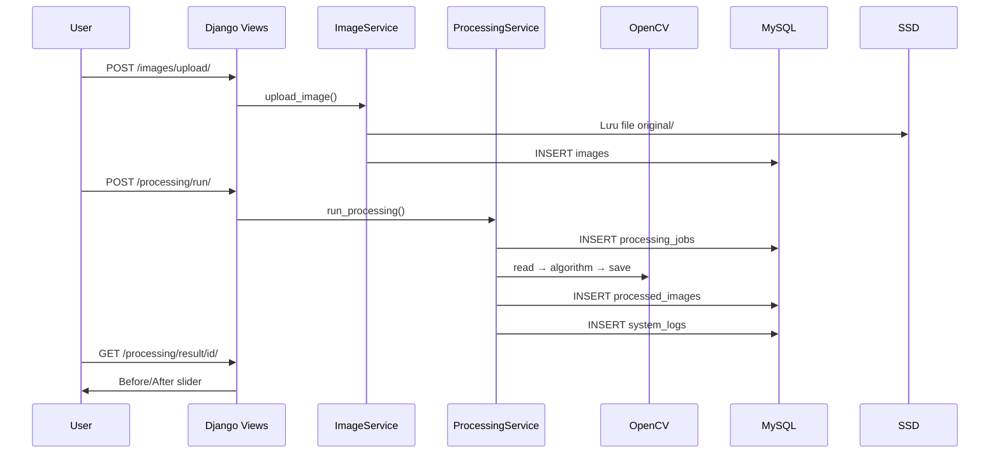

# Kiến trúc hệ thống

## Tổng quan 3 tầng



## Luồng xử lý ảnh (core business)



## Cấu trúc apps

| App | Trách nhiệm |
|-----|-------------|
| `authentication` | User model, login, `init_db` |
| `dashboard` | Trang tổng quan user |
| `images` | Upload, gallery, delete |
| `algorithms` | Seed & CRUD thuật toán |
| `processing` | Jobs, pipeline, history |
| `admin_panel` | Admin UI + `SystemLog` |

## OpenCV service layer

```
services/opencv/
├── registry.py      # Map code → processor
├── opencv_service.py # read/save image
└── processors.py    # grayscale, blur, canny, ...
```

Registry pattern: `Algorithm.code` trong DB khớp handler trong `registry.py`.

## Bảo mật & phân quyền

- `@login_required` — mọi trang user/admin (trừ auth)
- `@admin_required` — `/admin-panel/*` (role=admin)
- User chỉ truy cập ảnh/job của mình; **admin xem được mọi job**

## Frontend stack

| Thành phần | Dùng cho |
|------------|----------|
| Tailwind + DaisyUI | Layout, components |
| HTMX | Upload, xử lý, filter bảng |
| Alpine.js | Pipeline steps, Before/After slider |
| GSAP | Animation trang, toast |
| app.js / app.css | Toast, skeleton, progress bar |

## Deploy notes (tham khảo)

- `DEBUG=False`, `ALLOWED_HOSTS`, `CSRF_TRUSTED_ORIGINS`
- `collectstatic` + reverse proxy (nginx)
- MySQL connection pool, backup media + DB
- File log rotation đã cấu hình trong loguru (7 ngày)
